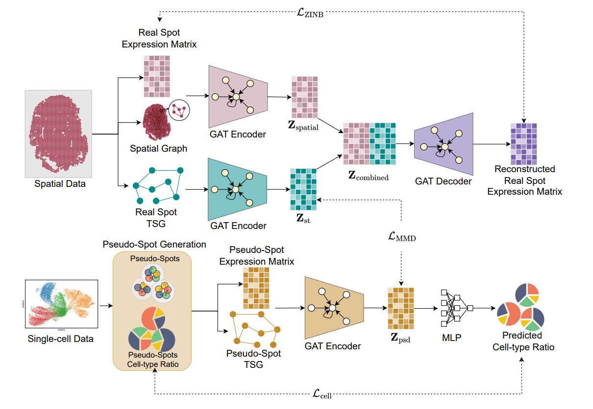

# **SPIDER: Spatially Integrated Denoising via Embedding Regularization with Single-Cell Supervision**

<p align="center">
  
</p>

**Figure:** *Overview of SPIDER framework.* SPIDER integrates spatial transcriptomics (ST) data with reference scRNA-seq information by jointly leveraging spatial structure, transcriptional similarity, and pseudo-ST supervision. The framework first constructs three graphs: a spatial neighborhood graph derived from spot coordinates, and two transcriptional similarity graphs (TSGs) built from real ST spots and pseudo-spots generated from scRNA-seq data from the same tissue type. A tri-branch graph attention encoder then learns low-dimensional latent representations from these graphs. The pseudo-ST branch incorporates supervision by optimizing cell-type ratio prediction, while an embedding regularization term aligns the real ST and pseudo-ST embeddings to transfer cell-type structure from the reference domain. A unified graph attention decoder reconstructs gene expression using a zero-inflated negative binomial likelihood. The resulting denoised expression matrix can be used for downstream analyses, including spatial domain identification, marker gene pattern recovery, and improved clustering performance.*

---

## 📦 Installation


Install the conda environment using the bash file 
```bash
git clone https://github.com/compbiolabucf/SPIDER.git
cd SPIDER
conda env create -f environment.yml
conda activate spider
```

Next install R version 4.5.1

You can try using the following command from the **spider** environment

```bash
conda install -c conda-forge r-base=4.5.1
```

Or 

```bash
sudo apt update
sudo apt install -y build-essential gfortran libreadline-dev libx11-dev libxt-dev libpng-dev libjpeg-dev libcairo2-dev libssl-dev libcurl4-openssl-dev libbz2-dev liblzma-dev libpcre2-dev libxml2-dev zlib1g-dev wget tar
wget https://cran.r-project.org/src/base/R-4/R-4.5.1.tar.gz
tar -xvf R-4.5.1.tar.gz
cd R-4.5.1
./configure --enable-R-shlib --with-blas --with-lapack --with-icu-lib=/usr/lib/x86_64-linux-gnu
make -j$(nproc)
sudo make install
```

Install required libraries for python 

```bash
chmod +x create_environment.sh
./create_environment.sh
```

Install SPIDER inside the environment 
```bash
python setup.py build
python setup.py install

```


## Running Denoising 

The DLPFC dataset can be downloaded from this [link](https://drive.google.com/file/d/14sieoleV-a8Hx9KVVWDFZk5-5MjGsRLT/view?usp=sharing).
The CID44971 breast cancer dataset can be downloaded from this [link](https://drive.google.com/file/d/1SkH6o1K3UTm1Z6mejnVw34PUvoqfcoVW/view?usp=drive_link).

Or by running 
```bash
wget https://huggingface.co/datasets/istiaq28/DLPFC_SPIDER/resolve/main/DLPFC_data.pickle -O data/DLPFC_data.pickle
```
The DLPFC data should be placed in the "data/" directory to run the "tutorial.ipynb".

The sample dataset is created using ***preprocess_data.py***, using the DLPFC ST and SC data to create pseudo ST data. 

The file contains preprocessed DLPFC data and a pseudo spot data created from reference scRNA-seq data. 
Use the ***tutorial.ipynb*** file to run the denoiser. 

Provided ST data and SC data,  ***preprocess_data.py*** can be used to create the data pickle file before running the denoiser.

For terminal usage you can run ```python trainer.py <data-path>```

Using the pickle file which contains DLPFC real-ST and pseudo-ST data, denoiser can be run usning the terminal 

```bash
python trainer.py data/DLPFC_data.pickle

```

Hyperparameters can be changes inside the script's **params** varaible. 
This will generate a clustering plot and a training loss plot inside *results* directory and show the. 


## Dependencies

The SPIDER framework requires the following core dependencies:

```
python = 3.8.20
cuda == 11.8 
torch == 2.1.0+cu118
torch-geometric == 2.4.0
torch-cluster == 1.6.3+pt21cu118
torch-scatter == 2.1.2
torch-sparse == 0.6.18
R == 4.5.1 (R package mclust 5.4.10)
```
## Citation
